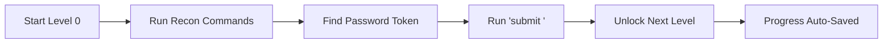

# 🛡️ Cyber Security CLI Lab (35 Progressive Levels)

<p align="center">
  
  
  
  
  
</p>

An interactive, browser-based **Linux Cybersecurity CLI Wargame** designed to teach Linux commands, shell navigation, permissions, cryptography, network reconnaissance, and privilege escalation across **35 progressive levels (Level 0 to Level 34)**.

Inspired by **OverTheWire Bandit** and **TryHackMe**, featuring an in-browser Linux terminal, realistic virtual filesystem, interactive command manual with attribute/flag explorer, 3-tier hints, dynamic random passwords, and persistent progress tracking.

---

## 🌟 Key Features

- **Realistic In-Browser Linux Terminal**: Command history (`Up`/`Down` arrows), Tab auto-completion, pipes (`|`), redirection (`>`), ANSI colors, and retro CRT scanlines.
- **35 Progressive Levels (0–34)**: From basic directory navigation up to SUID privilege escalation, Git forensics, and shared memory dump extraction.
- **Dynamic Random Passwords**: Every lab run generates unique, random CTF tokens (e.g. `cyb3r_955fafde_p4ss`). Passwords change dynamically so learners must use real tools to find them.
- **Interactive Command Manual & Attribute Inspector**: Click any Linux command (e.g. `ls`, `grep`, `find`) to see what every flag does (e.g. `ls -a`, `grep -i`, `find -perm -4000`) with cybersecurity context and a click-to-try button.
- **3-Tier Hint System**: Get gentle conceptual nudges, recommended flags, or full syntax blueprints when stuck.
- **Complete Solutions Manual**: Full step-by-step solutions for all 35 levels with command explanations are available in [docs/solutions.md](docs/solutions.md).
- **Multi-Platform Access**: Launch via GitHub Pages, Docker, Python, Node, or by double-clicking a file!

---

## 🚀 Quick Start & Access (Run in Seconds)

### 1. 🌐 Live Online (Zero Installation - Play in Browser)
The lab is deployed and live for anyone to access directly:
👉 **[https://nadeemmhdm.github.io/cyber-security-cli-lab/](https://nadeemmhdm.github.io/cyber-security-cli-lab/)**

No installation, no downloads—instant interactive browser terminal!

---

### 2. 🪟 Windows (1-Click)
Double-click [`start.bat`](start.bat) or run in Command Prompt:
```cmd
start.bat
```
This automatically launches the server and opens your browser at `http://localhost:8085`.

---

### 3. 🐧 Linux / 🍎 macOS (1-Click)
Make the script executable and run:
```bash
chmod +x start.sh
./start.sh
```

---

### 4. 🐳 Docker (Cross-Platform)
Run with a single Docker command:
```bash
# Build and run container
docker build -t cyberlab .
docker run -d -p 8085:80 --name cyberlab-cli cyberlab
```
Or with Docker Compose:
```bash
docker compose up -d
```
Then visit **[http://localhost:8085](http://localhost:8085)**.

---

### 5. 🐍 Python (Built-in)
Works on any machine with Python installed:
```bash
# Python 3
python3 -m http.server 8085

# Python 2 (legacy)
python -m SimpleHTTPServer 8085
```
Then open **[http://localhost:8085](http://localhost:8085)**.

---

### 6. 📦 Node.js / npm
```bash
npx -y serve -l 8085 .
# or
npm start
```

---

### 7. 📁 Direct File Open (Offline)
Simply double-click [`index.html`](index.html) to open the lab directly in Chrome, Firefox, Edge, or Safari. No web server needed!

---

## 🎯 How to Play & Game Mechanics



1. **Start at Level 0**: You begin logged in as `level0` with a mission objective in the sidebar.
2. **Recon the Filesystem**: Use commands like `ls -la`, `cat`, `file`, `grep`, and `find` to hunt for the password.
3. **Submit Discovered Password**:
   - In terminal: `submit <password>`
   - Or enter it in the **"Submit Level Password"** box in the right sidebar.
4. **Advance & Level Up**: The terminal unlocks the next level, updates your prompt (`level1@cyberlab:~$`), and auto-saves to `localStorage`.
5. **Re-roll Anytime**: Inside **Settings (`⚙️`)**, click **"Re-roll / Randomize All Passwords"** to generate a brand new set of 35 random tokens anytime!

---

## 📚 35 Progressive Levels Syllabus

| Levels | Category | Key Commands & Concepts Learned |
|:---|:---|:---|
| **0 – 5** | **Linux Basics & Navigation** | Navigation (`pwd`, `cd`), reading files (`cat`), dashed filenames (`cat ./-`), handling spaces in filenames, hidden dotfiles (`ls -a`), magic byte identification (`file`), and size-based searches (`find inhere -size 1033c`). |
| **6 – 10** | **Data Search & Text Processing** | System-wide searches (`find / -user level7 -group level6`), regex pattern matching (`grep`), unique line extraction (`sort \| uniq -u`), string extraction from binary dumps (`strings`), and Base64 decoding (`base64 -d`). |
| **11 – 15** | **Cryptography & Networking** | Caesar / ROT13 ciphers (`tr 'A-Za-z' 'N-ZA-Mn-za-m'`), multi-layer archive unpacking (`xxd -r`, `tar`, `gzip`, `bzip2`), SSH key-based authentication (`ssh -i`), local socket communication (`nc`), and SSL/TLS encrypted services (`openssl s_client`). |
| **16 – 20** | **Recon & SUID Privilege Escalation** | Network port scanning (`nmap -p 31000-31010`), file diff analysis (`diff`), forensic log auditing (`/var/log/auth.log`), SetUID binary enumeration (`find / -perm -4000`), and SetUID execution. |
| **21 – 25** | **Cron Tasks & Scripting** | Scheduled job analysis (`/etc/cron.d/`), script MD5 path prediction, wildcard script injection, network PIN brute-forcing daemon, and SetGID group permissions (`id`, `groups`). |
| **26 – 30** | **Shell Breakouts & Git Forensics** | Pager escape analysis, Git commit history secret hunting (`git log -p`), hidden Git branches (`git branch -a`, `git checkout`), release tags (`git tag -n`), and remote Git branch diff analysis (`git diff master origin/dev`). |
| **31 – 34** | **Forensics & Master CTF Flag** | Leaked environment variables (`env`), restricted shell escapes, Linux POSIX capabilities (`getcap -r /`), and shared memory carving (`strings /dev/shm/memory_dump.raw`) to claim the Master Flag! |

---

## 🔍 Interactive Command Manual & Attribute Inspector

Click **"Help & Attributes"** in the top navigation bar or type `help <command>` in the terminal to inspect commands:

- **Attributes Breakdown**: Detailed explanations for flags (e.g. `ls -a`, `ls -l`, `ls -lh`, `grep -i`, `grep -v`, `find -perm -4000`, `tar -xzf`, `nmap -sV`).
- **Cybersecurity Context**: Explains why and how ethical hackers and security professionals use each specific flag.
- **Try in Terminal**: Click the **"Try in Terminal"** button next to any attribute example to paste it directly into your terminal prompt!

---

## 📤 Publishing to GitHub (Share with Anyone)

To host this lab on GitHub and share it with students, colleagues, or friends:

```bash
# 1. Initialize git repository
git init

# 2. Add all files
git add .

# 3. Commit
git commit -m "Initial commit: Cyber Security CLI Lab (35 Levels)"

# 4. Create repository on GitHub, then link remote:
git branch -M main
git remote add origin https://github.com/<your-username>/<your-repo-name>.git

# 5. Push code
git push -u origin main
```

### Enable GitHub Pages (Instant Free Hosting):
1. Go to your GitHub repository **Settings** $\to$ **Pages**.
2. Under **Build and deployment** $\to$ **Source**, choose **GitHub Actions**.
3. The included workflow [`.github/workflows/deploy.yml`](.github/workflows/deploy.yml) will automatically build and publish your site!
4. Your lab is now playable by anyone at:
   `https://<your-username>.github.io/<your-repo-name>/`

---

## 📂 Repository File Structure

```
.
├── index.html                    # Main HTML application & modal dialogs
├── package.json                  # NPM metadata and launch scripts
├── Dockerfile                    # Production lightweight Nginx container
├── docker-compose.yml            # 1-command Docker deployment
├── start.bat                     # 1-click Windows launcher
├── start.sh                      # 1-click Linux/macOS launcher
├── LICENSE                       # MIT Open Source License
├── .gitignore                    # Git ignore file
├── .github/
│   └── workflows/
│       └── deploy.yml            # Automated GitHub Pages CI/CD workflow
├── css/
│   ├── style.css                 # Cyberpunk glassmorphism design system
│   └── terminal.css              # Terminal emulator styling & CRT scanlines
└── js/
    ├── app.js                    # UI coordinator, modals, audio controller
    ├── commands.js               # Linux command parser, pipelines & tools
    ├── commandDocs.js            # Command manual & attributes inspector data
    ├── levels.js                 # 35 progressive levels definitions & setup
    ├── storage.js                # Dynamic random passwords & progress persistence
    ├── terminal.js               # Terminal I/O, history, Tab completion, Web Audio
    └── vfs.js                    # In-memory Virtual Unix Filesystem
```

---

## 🤝 Contributing

Contributions, new levels, additional commands, and translations are welcome!
1. Fork the Project
2. Create your Feature Branch (`git checkout -b feature/NewLevel`)
3. Commit your Changes (`git commit -m 'Add Level 35 Challenge'`)
4. Push to the Branch (`git push origin feature/NewLevel`)
5. Open a Pull Request

---

## 📄 License

Distributed under the **MIT License**. See [`LICENSE`](LICENSE) for more information.
